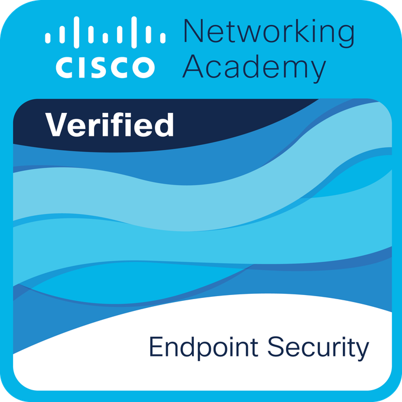

## Hi, I’m Sravan Kumar Velicheti👋

Full Stack Developer with a Master’s degree in Computer Science and hands-on experience building scalable, cloud-ready web applications using Java, Spring Boot, and modern frontend frameworks.

- 👨‍💻 **Projects:** [Click here to view my work](https://github.com/sravankumarvelicheti)
- 📫 **Email:** svelicheti9@gmail.com
- ### Connect with me:

- ### Languages and Tools:
<a href="https://www.linkedin.com/in/sravan-kumar-v-9826bb1a2/" target="_blank">
  

  

  

  

  

  

  

  

  

  

  

  

  

## Certifications

  

  &nbsp;&nbsp;&nbsp;&nbsp;

  

### What I Build
- Scalable backend services and REST APIs
- Full-stack web applications
- Cloud-deployed, containerized systems

### Currently Focusing On
- System design and backend scalability
- Cloud optimization and DevOps best practices
