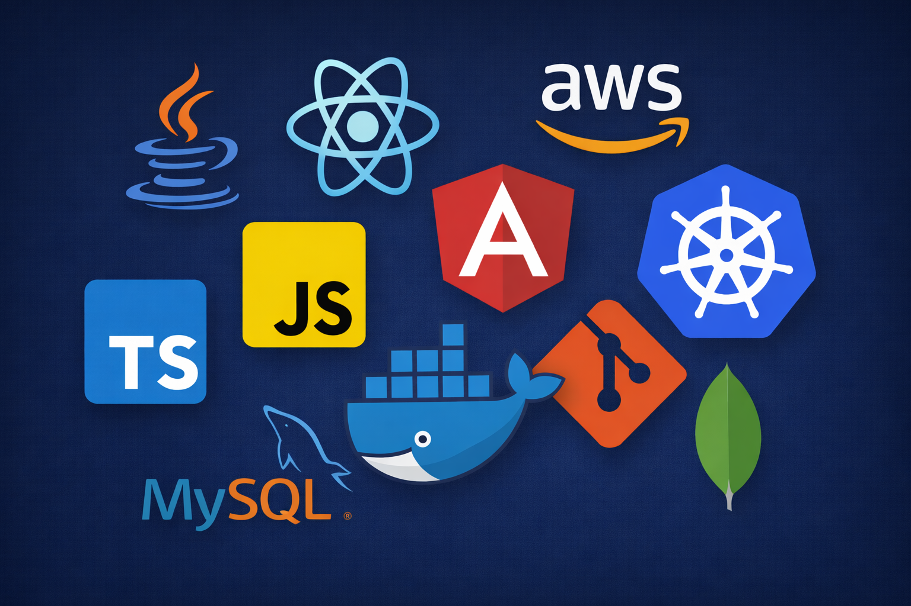

## Hi, I’m Sravan Kumar Velicheti👋

Full Stack Developer with a Master’s degree in Computer Science and hands-on experience building scalable, cloud-ready web applications using Java, Spring Boot, and modern frontend frameworks.

🔗 **Projects:** [Click here to view my work](https://github.com/sravankumarvelicheti)
📫 Email: svelicheti9@gmail.com

  

### What I Build
- Scalable backend services and REST APIs
- Full-stack web applications
- Cloud-deployed, containerized systems

### Currently Focusing On
- System design and backend scalability
- Cloud optimization and DevOps best practices
